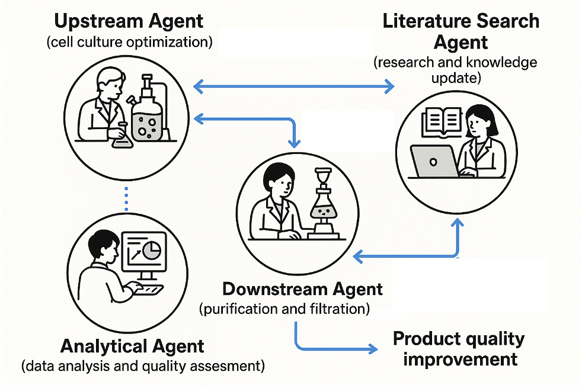

# Multi-Agent AI Bioprocess Digital Twin Pipeline

## Overview

This repository implements a modular digital twin for biomanufacturing, orchestrated with a **multi-agent AI pipeline** using [LangGraph](https://langchain-ai.github.io/langgraph/concepts/multi_agent/), real-time data simulation, and live dashboard visualization. The system demonstrates:
- **Synthetic real-time data generation** of mammalian cell culture processes
- **Multi-agent AI prediction** of upstream viability collapse
- **Interactive Gradio dashboard** for live metrics, plots, and status

---

## Workflow Architecture

<!--
**Insert workflow architecture diagram or image here**
-->


The architecture consists of a _RealTimeBioprocessSimulator_ agent streaming data to an _UpstreamViabilityAgent_, with all steps orchestrated in a LangGraph pipeline. Results are visualized in a live Gradio dashboard.

---

## Repository Structure

| File/Directory                      | Description                                              |
| ----------------------------------- | -------------------------------------------------------- |
| `agent_bioprocess_datastream.py`    | Agent for real-time/upstream bioprocess data simulation  |
| `agent_upstream_cell_viability.py`  | AI agent for predicting cell viability collapse          |
| `data_generator.py`                 | Utilities for batch or on-demand synthetic data creation |
| `multi_agent_langgraph_pipeline.py` | LangGraph workflow tying agents into a streaming pipeline|
| `dashboard_realtime_pipeline.py`    | Gradio dashboard for live agent workflow visualization   |
| `execution_guide.py`                | Quickstart/CLI for testing, running pipeline, and launching dashboard |
| `images/`                           | Workflow architecture diagrams, icons, or screenshots  |

---

## Quick Start

### Requirements

- `python >= 3.8`
- `pip install -r requirements.txt`

### 1. Run the interactive execution CLI to setup environment, test agents, run pipeline and launch dashboard
```
python execution_guide.py
```

### 2. Simulate and run the multi-agent predictive pipeline for N hours/samples [Option #3 in interactive CLI]
```
python multi_agent_langgraph_pipeline.py
```

### 3. Launch the interactive Live Dashboard [Option #4 in interactive CLI]
```
python dashboard_realtime_pipeline.py
```

---

## How It Works

1. **Synthetic Data Generator Agent:**  
   Generates structured, biologically-plausible process metrics in real time.

2. **Upstream Viability AI Agent:**  
   Predicts risk of cell viability collapse using per-sample and historical features.

3. **LangGraph Orchestration:**  
   Modular pipeline for agent communication, data flow, and robust state management.

4. **Dashboard Visualization:**  
   Interactive UI to monitor simulations, predictions, and process health in real time.

---

## Example Results

<!--
Add images or plots from the dashboard, such as:
- Sample plot of viability percent over batch time
- Real-time dashboard screenshot
- Agent status “Collapse/No Collapse” icons
-->


---

## Extensibility

- Add new agents (e.g., downstream purification, contamination monitoring)



- Integrate support for real process data and advanced predictive models
- Extend dashboard panels for process optimization, alarms, or multi-batch reporting


---

## Acknowledgments

- [LangGraph](https://langchain-ai.github.io/langgraph/) and [LangChain](https://python.langchain.com/docs/)
- [Gradio](https://gradio.app/)
- Inspired by modern AI agent architectures for healthcare and digital twins.

## License

[MIT](https://mit-license.org/)

## Contact
  
Guna Gurazada (guna DOT udel AT gmail DOT com)


